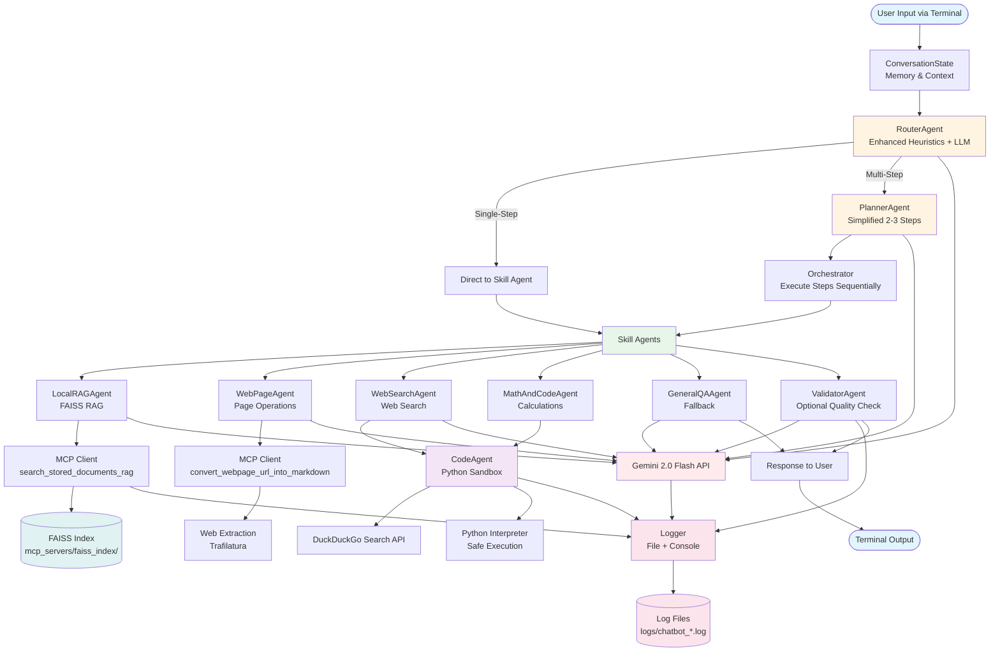

# Chatbot Architecture: Multi-Agent System with RAG, Web, and Code Execution

## Overview

This document describes the architecture of a **terminal-based chatbot** that can handle:
- **Web page operations** (summarize, count words, extract URLs)
- **Web search** (search and process results)
- **Local RAG** (query documents using FAISS vector store via MCP)
- **Math & factual queries** (using code execution)
- **General Q&A** (fallback reasoning)

---

## 1. System Architecture

### 1.1 High-Level Flow

```
User Input (Terminal)
    ↓
ConversationState (Memory)
    ↓
RouterAgent (Decision Engine with Enhanced Heuristics)
    ↓
    ├─→ Single-Step: Direct to Skill Agent
    └─→ Multi-Step: PlannerAgent → Orchestrator → Skill Agents
    ↓
Skill Agents (WebPage, WebSearch, LocalRAG, MathCode, GeneralQA)
    ↓
    ├─→ MCP Tools (FAISS RAG, Web Extraction)
    ├─→ CodeAgent (Python Execution for Math/Web)
    └─→ Gemini 2.0 API (LLM Reasoning)
    ↓
ValidatorAgent (Optional Quality Check)
    ↓
Response → Terminal Output
```

### 1.2 Core Components

1. **TerminalChatLoop**: CLI interface
2. **ConversationState**: Session memory & context
3. **RouterAgent**: Enhanced routing with heuristics
4. **PlannerAgent**: Multi-step task decomposition (optional)
5. **ValidatorAgent**: Answer quality check (optional)
6. **Skill Agents**: Specialized task handlers
7. **CodeAgent**: Python code execution for math/web operations
8. **MCP Integration**: FAISS RAG & document tools

---

## 2. LLM Configuration

### 2.1 Primary Model: Gemini 2.0 Flash

- **Provider**: Google Gemini API
- **Model**: `gemini-2.0-flash-exp` (fast, efficient)
- **Usage**:
  - RouterAgent classification
  - PlannerAgent task decomposition
  - Skill Agents reasoning & generation
  - ValidatorAgent quality checks
- **API Key**: Environment variable `GOOGLE_API_KEY` (stored in `.env` file)

### 2.2 Fallback Strategy

- If Gemini fails → Log error with full context, return user-friendly message
- For code execution → Use Python interpreter (no LLM needed)
- Retry logic: 3 attempts with exponential backoff for transient errors

---

## 3. Enhanced RouterAgent with Heuristics

### 3.1 Routing Decision Logic

The RouterAgent uses a **hybrid approach**: rule-based heuristics + LLM classification.

#### 3.1.1 Rule-Based Heuristics (Fast Path)

**Web Page Operations** (`web_page_ops`):
- Keywords: `"this page"`, `"current page"`, `"the page"`, `"page"` + action verb
- Patterns: `"summarize this page"`, `"count words in page"`, `"extract urls from page"`
- Action verbs: `summarize`, `summarise`, `count`, `extract`, `find`, `get`, `show`
- URL presence: If query contains `http://` or `https://` → likely web page operation

**Web Search** (`web_search`):
- Keywords: `"search the web"`, `"google"`, `"find article"`, `"search for"`, `"look up"`
- Patterns: `"search for X"`, `"find information about Y"`, `"what is X"` (if not in local docs)
- Question words: `"who"`, `"what"`, `"where"`, `"when"` + `"search"` or `"find"`

**Local RAG** (`local_rag`):
- Keywords: `"in my notes"`, `"in my documents"`, `"in the folder"`, `"in files"`, `"in docs"`
- Patterns: `"search my notes for X"`, `"which file contains Y"`, `"in documents"`
- Context: If previous conversation mentioned a folder/document → likely RAG

**Math/Code** (`math`):
- Math operators: `+`, `-`, `*`, `/`, `^`, `sqrt`, `integral`, `derivative`
- Keywords: `"calculate"`, `"compute"`, `"solve"`, `"what is"` + number/expression
- Patterns: `"37^5"`, `"integrate x^2"`, `"probability of"`, `"statistics"`
- Code-like: `"write code to"`, `"simulate"`, `"generate"` + data structure

**General QA** (`general`):
- Fallback: If no specific patterns match
- Conversational: `"explain"`, `"tell me about"`, `"how does"`, `"why"`

#### 3.1.2 LLM Classification (When Uncertain)

If heuristics are ambiguous or query is complex:
- Send to Gemini 2.0 with prompt:
  ```
  Classify this query into ONE category:
  - web_page_ops: Operations on a specific web page (summarize, count, extract)
  - web_search: Search the internet for information
  - local_rag: Query local documents/folders
  - math: Mathematical calculations or code execution
  - general: General Q&A or explanation
  - mixed: Requires multiple steps/agents
  
  Query: "{user_query}"
  
  Respond with JSON: {"task_type": "...", "confidence": 0.0-1.0, "reasoning": "..."}
  ```

#### 3.1.3 RouterAgent Output

```python
RouterDecision = {
    "task_type": str,  # web_page_ops | web_search | local_rag | math | general | mixed
    "confidence": float,  # 0.0-1.0
    "needs_planning": bool,  # True if multi-step
    "tool_hints": List[str],  # ["web", "rag"] for mixed tasks
    "reasoning": str  # Why this classification
}
```

### 3.2 Limitations

- Heuristics may misclassify ambiguous queries (e.g., "search my notes" vs "search the web")
- LLM classification adds latency (~200-500ms)
- Confidence threshold: If < 0.6, ask user for clarification (optional)

---

## 4. Skill Agents

### 4.1 WebPageAgent

**Purpose**: Operate on a specific web page (summarize, count words, extract URLs).

**Tools**:
- MCP: `convert_webpage_url_into_markdown` (from your `mcp_server_2.py`)
- CodeAgent: For word counting, URL extraction, text processing

**Workflow**:
1. Extract URL from query or use "current page" (if browser MCP available)
2. Call MCP `convert_webpage_url_into_markdown` → get clean markdown
3. For **summarize**: Send markdown + query to Gemini 2.0
4. For **word count**: Use CodeAgent to count occurrences (regex/count)
5. For **URL extraction**: Use CodeAgent to parse HTML/markdown, extract `href`, filter by topic using Gemini if needed

**Example Queries**:
- "Summarise this page"
- "How many times is 'transformer' repeated on this page?"
- "Extract URLs related to 'semaris create' from this page"

**Limitations**:
- Requires valid URL or browser context
- Word counting is case-sensitive by default (can make case-insensitive)
- URL extraction may miss JavaScript-rendered links

---

### 4.2 WebSearchAgent

**Purpose**: Search the web and process results.

**Tools**:
- **CodeAgent**: Generate Python code to:
  - Call DuckDuckGo search API (via `duckduckgo-search` library)
  - Parse search results
  - Rank/filter results
- **WebPageAgent**: Fetch and process top results

**Workflow**:
1. Extract search query from user input
2. CodeAgent generates Python code to:
   ```python
   # Use duckduckgo_search library
   from duckduckgo_search import DDGS
   results = DDGS().text("semaris create", max_results=5)
   # Return: [{"title": "...", "url": "...", "snippet": "..."}]
   ```
3. Execute code → get search results (with error handling & logging)
4. If user wants summarization: For each top result, call WebPageAgent
5. Combine results and send to Gemini 2.0 for final answer

**Example Queries**:
- "Search the web for 'RAG architecture tutorial' and summarise 2 resources"
- "Find the official docs for semaris create"

**Limitations**:
- Depends on search API availability (rate limits, API keys)
- CodeAgent must generate safe, sandboxed code
- May not access all websites (some block scrapers)

---

### 4.3 LocalRAGAgent

**Purpose**: Query local documents using FAISS vector store.

**Tools**:
- MCP: `search_stored_documents_rag` (from your `mcp_server_2.py`)
- This tool uses your existing FAISS index at `mcp_servers/faiss_index/`

**Workflow**:
1. Extract query from user input
2. Call MCP tool: `search_stored_documents_rag({"query": "..."})`
3. Receive top-k chunks with metadata (doc name, chunk_id)
4. Build RAG prompt:
   ```
   Context from documents:
   [Chunk 1 from cricket.txt]
   [Chunk 2 from dlf.md]
   ...
   
   Question: {user_query}
   
   Answer based on the context above. If information is not found, say so explicitly.
   ```
5. Send to Gemini 2.0 → get answer
6. Include source citations: `[Source: cricket.txt, chunk_id: cricket_0]`

**Example Queries**:
- "Search my notes for 'RAG architecture' and summarise"
- "Which file mentions 'DLF'?"
- "What is cricket according to my documents?"

**Limitations**:
- Only searches **indexed documents** (in `mcp_servers/documents/`)
- Requires FAISS index to be built (your MCP server handles this)
- Retrieval quality depends on embedding model (nomic-embed-text in your setup)
- May return irrelevant chunks if query is ambiguous

---

### 4.4 MathAndCodeAgent

**Purpose**: Handle mathematical calculations and code-like tasks.

**Tools**:
- **CodeAgent**: Execute Python code in sandbox

**Workflow**:
1. Parse query to extract:
   - Math expression (e.g., "37^5", "integrate x^2 from 0 to 1")
   - Code requirement (e.g., "simulate 100 coin flips")
2. CodeAgent generates Python code:
   ```python
   # Example for 37^5
   result = 37 ** 5
   print(result)
   
   # Example for integration
   from scipy.integrate import quad
   result, error = quad(lambda x: x**2, 0, 1)
   print(f"Result: {result}")
   ```
3. Execute in sandbox (restricted: no file system, network, dangerous imports)
4. Return result to user
5. Optionally: Use Gemini 2.0 to explain the calculation

**Example Queries**:
- "What is 37^5?"
- "Compute the integral of x^2 from 0 to 1"
- "Simulate 100 coin flips and give probability of heads"

**Limitations**:
- Sandbox restrictions: No `os.system`, `subprocess`, file writes, network calls
- Complex symbolic math may require SymPy (add to sandbox if needed)
- Code execution safety: We validate imports and block dangerous operations

---

### 4.5 GeneralQAAgent

**Purpose**: Fallback for general questions, explanations, comparisons.

**Tools**:
- Gemini 2.0 API (direct LLM call)

**Workflow**:
1. Build prompt from conversation history + current query
2. Send to Gemini 2.0
3. Return response

**Example Queries**:
- "Explain RAG like I'm a beginner"
- "What is the difference between transformers and RNNs?"
- "How does attention mechanism work?"

**Limitations**:
- No guaranteed factual grounding (may hallucinate)
- Should only be used when RouterAgent determines no special tools needed

---

## 5. CodeAgent (New Component)

### 5.1 Purpose

Execute Python code **safely** for:
- Math calculations
- Web search API calls
- Text processing (word counting, URL extraction)
- Data manipulation

### 5.2 Implementation

**Sandbox Environment** (Moderate Strictness):
- Use `exec()` with restricted namespace
- Block dangerous operations:
  - File system writes (`open(..., 'w')`, `os.remove`, etc.)
  - System commands (`os.system`, `subprocess.call` with shell=True)
  - Dangerous imports (`subprocess` with shell=True, `shutil` for deletion)
- **Allow**: `requests` library for web search (moderate strictness as requested)

**Allowed Operations**:
- Math: `math`, `numpy`, `scipy` (if installed)
- String processing: `re`, `json`
- Web search: `requests`, `duckduckgo_search` (for WebSearchAgent)
- Data structures: lists, dicts, sets
- Network: `requests` (allowed for web search operations)

**Code Generation**:
- Gemini 2.0 generates code based on user query
- Prompt: "Generate Python code to {task}. Code should be safe and only use allowed libraries."

**Execution Flow**:
```python
def execute_code_safely(code: str, allowed_imports: List[str]) -> str:
    # 1. Parse AST to check for dangerous operations
    # 2. Whitelist imports (allow requests for web search)
    # 3. Execute in restricted namespace
    # 4. Capture stdout/stderr
    # 5. Log execution (success/failure) to file
    # 6. Return result or error
```

### 5.3 Limitations

- Cannot access local files (unless explicitly allowed for RAG)
- Network calls only for web search (rate-limited)
- Complex code may fail → return error message
- Security: Sandbox is not 100% secure; use with caution

---

## 6. PlannerAgent (Optional)

### 6.1 When Used (Simplified Version)

- RouterAgent decides `task_type = mixed` or `needs_planning = True`
- **Simplified approach**: Only break into 2-3 steps max (avoid over-complication)
- Example: "Search the web for semaris create, then get the URL where official docs are, then summarise that page"

### 6.2 Workflow (Simplified)

1. Receive user query + RouterDecision
2. Send to Gemini 2.0 with simplified prompt (max 3 steps):
   ```
   Break this task into steps. Each step should use one agent:
   - WebSearchAgent: Search the web
   - WebPageAgent: Operate on a web page
   - LocalRAGAgent: Query local documents
   - MathAndCodeAgent: Calculate or execute code
   - GeneralQAAgent: General reasoning
   
   Task: "{user_query}"
   
   Respond with JSON:
   {
     "steps": [
       {"step": 1, "agent": "WebSearchAgent", "action": "Search for 'semaris create official docs'", "input": "..."},
       {"step": 2, "agent": "WebPageAgent", "action": "Extract URL from search results", "input": "..."},
       {"step": 3, "agent": "WebPageAgent", "action": "Summarise the page at extracted URL", "input": "..."}
     ]
   }
   ```
3. Parse plan → return `ExecutionPlan`
4. Orchestrator executes steps in order, passing results between steps

### 6.3 Limitations

- Plans may be imperfect (LLM-generated)
- If a step fails, we stop and report error (no automatic recovery)
- Complex multi-step tasks may take time

---

## 7. ValidatorAgent (Optional)

### 7.1 When Used

- After skill agent generates answer
- For RAG answers (to check if answer is grounded in documents)
- For web page operations (to verify we followed instructions)

### 7.2 Workflow

1. Receive: `user_query`, `agent_answer`, `evidence` (optional)
2. Send to Gemini 2.0:
   ```
   Check if this answer correctly addresses the user's query.
   User query: "{user_query}"
   Answer: "{agent_answer}"
   Evidence: "{evidence}"
   
   Respond with JSON:
   {
     "is_valid": true/false,
     "confidence": 0.0-1.0,
     "improvements": "..." or null,
     "final_answer": "..." (if improvements needed)
   }
   ```
3. If `is_valid = False` or `confidence < 0.7`: Use `final_answer` or return improvements

### 7.3 Limitations

- Adds latency (extra LLM call)
- May not catch all errors
- We'll enable selectively (RAG + web tasks, not every chat)

---

## 8. ConversationState (Memory)

### 8.1 What It Stores

- **Message History**: Last N messages (user + assistant)
  - Format: `[{"role": "user/assistant", "content": "..."}, ...]`
  - Window: Last 10-20 messages (configurable)
- **Session Context**:
  - `last_task_type`: Last resolved task (web_page_ops, rag, etc.)
  - `last_url`: Last visited URL (for "this page" follow-ups)
  - `last_folder`: Last queried folder (for RAG follow-ups)
  - `last_search_query`: Last web search query

### 8.2 Usage

- RouterAgent uses context to interpret follow-ups:
  - "Now count words" → use `last_url` if task was web_page_ops
  - "Search the same folder" → use `last_folder` for RAG
- Skill agents use history to maintain conversation flow

### 8.3 Limitations

- Context window limited by model (Gemini 2.0 supports large context, but we'll window for efficiency)
- If conversation is very long, earlier context is lost
- No long-term memory across sessions (can add later)

---

## 9. MCP Integration

### 9.1 Existing MCP Server

Your `mcp_server_2.py` provides:
- `search_stored_documents_rag`: FAISS RAG search
- `convert_webpage_url_into_markdown`: Web page extraction
- `extract_pdf`: PDF to markdown (for indexing, not direct queries)

### 9.2 Integration Points

- **LocalRAGAgent** → calls `search_stored_documents_rag` via MCP
- **WebPageAgent** → calls `convert_webpage_url_into_markdown` via MCP
- Use `multiMCP.py` to manage MCP connections

### 9.3 MCP Client Setup

```python
from multiMCP import MultiMCP

mcp_client = MultiMCP([
    {
        "id": "rag_server",
        "script": "mcp_servers/mcp_server_2.py",
        "cwd": "mcp_servers"
    }
])

await mcp_client.initialize()
# Now can call: await mcp_client.call_tool("search_stored_documents_rag", {"input": {"query": "..."}})
```

### 9.4 Browser MCP (Optional)

- **Current**: No browser MCP available
- **Future**: Can add simple MCP code for basic browser operations (fetch current page, navigate)
- **Workaround**: For now, WebPageAgent requires explicit URLs in queries

---

## 10. Terminal Interface

### 10.1 TerminalChatLoop

**Simple REPL**:
```
> Summarise this page
[WebPageAgent] Fetching page...
[Response] ...

> How many times is 'transformer' in this page?
[WebPageAgent] Counting words...
[Response] The word 'transformer' appears 15 times.

> Search my notes for RAG
[LocalRAGAgent] Searching FAISS index...
[Response] Based on your documents: ...
```

**Features**:
- Clear agent labels in output (for learning)
- Error messages if tools fail
- Option to show RouterAgent decision (debug mode)

### 10.2 Commands

- `exit` / `quit`: End session
- `clear`: Clear conversation history
- `debug`: Toggle debug mode (show routing decisions)
- `help`: Show available commands

---

## 11. Testing Scenarios

### 11.1 Web Page Operations

1. **Summarize**: "Summarise this page" (with URL or current page)
   - Expected: Clean summary of page content
2. **Word Count**: "How many times is 'transformer' repeated on this page?"
   - Expected: Exact count (not LLM hallucination)
3. **URL Extraction**: "Extract URLs related to 'semaris create' from this page"
   - Expected: List of relevant URLs with context

### 11.2 Web Search

1. **Basic Search**: "Search the web for 'RAG architecture tutorial'"
   - Expected: List of search results
2. **Search + Summarize**: "Search for semaris create and summarise the official docs"
   - Expected: Search → Extract URL → Summarize page

### 11.3 Local RAG

1. **Basic Query**: "What is cricket according to my documents?"
   - Expected: Answer from `cricket.txt` with source citation
2. **File Search**: "Which file mentions DLF?"
   - Expected: `dlf.md` with relevant chunks

### 11.4 Math/Code

1. **Simple Math**: "What is 37^5?"
   - Expected: `69343957` (exact calculation)
2. **Integration**: "Compute the integral of x^2 from 0 to 1"
   - Expected: `0.333...` (using scipy or symbolic math)

### 11.5 Routing

1. **Ambiguous Query**: "Search for transformers"
   - Expected: Router asks clarification OR uses heuristics (web_search if no "in my notes")
2. **Multi-Step**: "Find the official docs for semaris create and summarise them"
   - Expected: PlannerAgent creates plan → WebSearchAgent → WebPageAgent

---

## 12. Error Handling & Logging (VERY IMPORTANT)

### 12.1 Logging Strategy

**Log Levels**:
- `DEBUG`: Detailed execution flow (agent decisions, tool calls, intermediate results)
- `INFO`: Normal operations (agent started, task completed)
- `WARNING`: Recoverable issues (retry attempts, fallback to alternative)
- `ERROR`: Failures that prevent task completion (API errors, tool failures)
- `CRITICAL`: System-level failures (MCP server down, configuration errors)

**Log Storage**:
- **File-based logging**: `logs/chatbot_YYYY-MM-DD.log` (daily rotation)
- **Structured format**: JSON for easy parsing and analysis
- **Console output**: User-friendly messages (no stack traces in terminal)

### 12.2 Error Handling by Component

#### 12.2.1 RouterAgent Errors

**Scenarios**:
- Gemini API failure → Log error, fallback to rule-based heuristics only
- Ambiguous classification → Log warning, ask user for clarification
- Timeout → Log error, default to `general` task type

**Log Format**:
```json
{
  "timestamp": "2025-01-XX 10:30:45",
  "level": "ERROR",
  "component": "RouterAgent",
  "error_type": "API_FAILURE",
  "query": "user query here",
  "fallback_used": "rule_based_heuristics",
  "traceback": "..."
}
```

#### 12.2.2 Skill Agent Errors

**LocalRAGAgent**:
- MCP server unavailable → Log ERROR, return: "RAG service unavailable. Please check MCP server."
- FAISS index missing → Log WARNING, attempt to rebuild index
- No results found → Log INFO, return: "No relevant documents found for your query."

**WebPageAgent**:
- URL fetch failure → Log ERROR with HTTP status code, return user-friendly message
- MCP tool timeout → Log WARNING, retry once
- Invalid URL → Log ERROR, return: "Invalid URL format."

**WebSearchAgent**:
- DuckDuckGo API failure → Log ERROR, return: "Web search temporarily unavailable."
- CodeAgent execution error → Log ERROR with code snippet, return: "Search failed. Please try again."

**MathAndCodeAgent**:
- Code syntax error → Log ERROR with code, return: "Invalid calculation. Please rephrase."
- Sandbox violation → Log CRITICAL (security concern), return: "Operation not allowed."
- Execution timeout → Log WARNING, return: "Calculation timed out."

**GeneralQAAgent**:
- Gemini API failure → Log ERROR, return: "Unable to process query. Please try again."

#### 12.2.3 CodeAgent Errors

**Sandbox Violations**:
- Dangerous import detected → Log CRITICAL, block execution
- File system write attempt → Log WARNING, block execution
- Network call to non-whitelisted domain → Log WARNING, block execution

**Execution Errors**:
- Syntax error → Log ERROR with code snippet
- Runtime error → Log ERROR with exception details
- Timeout → Log WARNING (code took >10 seconds)

**Log Format**:
```json
{
  "timestamp": "2025-01-XX 10:30:45",
  "level": "ERROR",
  "component": "CodeAgent",
  "operation": "execute_code",
  "code_snippet": "print(1/0)",
  "error": "ZeroDivisionError: division by zero",
  "allowed_imports": ["math", "requests", "duckduckgo_search"]
}
```

#### 12.2.4 MCP Client Errors

**Connection Failures**:
- MCP server not found → Log ERROR, return: "Document service unavailable."
- Tool not found → Log ERROR with tool name
- Timeout → Log WARNING, retry once

**Log Format**:
```json
{
  "timestamp": "2025-01-XX 10:30:45",
  "level": "ERROR",
  "component": "MCPClient",
  "server": "rag_server",
  "tool": "search_stored_documents_rag",
  "error": "Connection timeout",
  "retry_count": 1
}
```

#### 12.2.5 Gemini API Errors

**Error Types**:
- `API_KEY_INVALID` → Log CRITICAL, check `.env` file
- `RATE_LIMIT` → Log WARNING, implement exponential backoff
- `QUOTA_EXCEEDED` → Log ERROR, return: "API quota exceeded."
- `TIMEOUT` → Log WARNING, retry with longer timeout
- `INVALID_REQUEST` → Log ERROR, return: "Invalid request format."

**Retry Logic**:
- Max 3 retries with exponential backoff (1s, 2s, 4s)
- Log each retry attempt
- After 3 failures → Return user-friendly error message

### 12.3 Log File Structure

```
logs/
├── chatbot_2025-01-15.log
├── chatbot_2025-01-16.log
└── error_summary.json  # Aggregated errors for analysis
```

**Log Rotation**:
- Daily rotation (new file each day)
- Keep last 30 days of logs
- Compress logs older than 7 days

### 12.4 Error Recovery Strategies

1. **Transient Errors** (network, API rate limits):
   - Retry with exponential backoff
   - Log retry attempts
   - Return user-friendly message after max retries

2. **Permanent Errors** (invalid input, missing resources):
   - Log error immediately
   - Return specific error message to user
   - Do not retry

3. **Partial Failures** (some results, but not all):
   - Log warning
   - Return partial results with note: "Some results may be incomplete."

### 12.5 User-Facing Error Messages

**Principles**:
- **Never expose stack traces** to users
- **Be specific** about what went wrong (without technical jargon)
- **Suggest solutions** when possible
- **Maintain context** (what task was being performed)

**Examples**:
- ❌ Bad: "Error: ConnectionError: Failed to establish connection"
- ✅ Good: "Unable to search documents. The document service may be unavailable. Please try again in a moment."

### 12.6 Debug Mode

**When enabled** (`debug` command in terminal):
- Show RouterAgent decision (task_type, confidence)
- Show which tools were called
- Show execution time for each step
- Display log level in terminal (DEBUG messages)

**Log Location**: Always logged to file, debug mode only affects terminal output.

---

## 13. Architecture Diagrams

### 13.1 Mermaid Diagram



### 13.2 ASCII Architecture Diagram

```
┌─────────────────────────────────────────────────────────────────────────┐
│                         TERMINAL CHAT INTERFACE                          │
│                         (TerminalChatLoop)                               │
└──────────────────────────────┬──────────────────────────────────────────┘
                               │
                               ▼
┌─────────────────────────────────────────────────────────────────────────┐
│                      CONVERSATION STATE (Memory)                         │
│  • Message History (last 10-20 messages)                                │
│  • Session Context (last_url, last_folder, last_task_type)             │
└──────────────────────────────┬──────────────────────────────────────────┘
                               │
                               ▼
┌─────────────────────────────────────────────────────────────────────────┐
│                         ROUTER AGENT                                     │
│  ┌─────────────────────────────────────────────────────────────────┐   │
│  │ Rule-Based Heuristics (Fast Path)                               │   │
│  │  • web_page_ops: "this page", "summarize", URL patterns        │   │
│  │  • web_search: "search the web", "google", "find"              │   │
│  │  • local_rag: "in my notes", "in documents", "in files"        │   │
│  │  • math: operators, "calculate", "compute", "solve"            │   │
│  │  • general: fallback for explanations                           │   │
│  └─────────────────────────────────────────────────────────────────┘   │
│  ┌─────────────────────────────────────────────────────────────────┐   │
│  │ LLM Classification (When Uncertain)                            │   │
│  │  → Gemini 2.0 Flash API                                        │   │
│  └─────────────────────────────────────────────────────────────────┘   │
└───────────────┬─────────────────────────────────────────────────────────┘
                │
        ┌───────┴────────┐
        │                │
        ▼                ▼
   Single-Step      Multi-Step
        │                │
        │                ▼
        │        ┌──────────────────┐
        │        │ PLANNER AGENT    │
        │        │ (Simplified)     │
        │        │ Max 2-3 steps    │
        │        └────────┬─────────┘
        │                 │
        │                 ▼
        │        ┌──────────────────┐
        │        │  ORCHESTRATOR   │
        │        │ Execute Steps   │
        │        └────────┬─────────┘
        │                 │
        └─────────────────┘
                 │
                 ▼
┌─────────────────────────────────────────────────────────────────────────┐
│                          SKILL AGENTS                                   │
├─────────────────────────────────────────────────────────────────────────┤
│                                                                         │
│  ┌──────────────────┐  ┌──────────────────┐  ┌──────────────────┐      │
│  │ LOCAL RAG AGENT │  │  WEB PAGE AGENT │  │ WEB SEARCH AGENT │      │
│  │                 │  │                 │  │                  │      │
│  │ • Query FAISS   │  │ • Summarize     │  │ • Search Web     │      │
│  │ • Get chunks    │  │ • Count words   │  │ • Process results│      │
│  │ • Build RAG     │  │ • Extract URLs  │  │ • Use CodeAgent  │      │
│  │   prompt        │  │                 │  │                  │      │
│  │                 │  │                 │  │                  │      │
│  │ → MCP:         │  │ → MCP:          │  │ → CodeAgent:    │      │
│  │   search_      │  │   convert_      │  │   DuckDuckGo    │      │
│  │   stored_      │  │   webpage_      │  │   API calls     │      │
│  │   documents_   │  │   url_into_     │  │                 │      │
│  │   rag          │  │   markdown      │  │                 │      │
│  └────────┬───────┘  └────────┬────────┘  └────────┬─────────┘      │
│           │                   │                    │                 │
│  ┌────────┴───────┐  ┌────────┴────────┐  ┌────────┴─────────┐      │
│  │ MATH/CODE AGENT│  │ GENERAL QA     │  │                  │      │
│  │                │  │ AGENT          │  │                  │      │
│  │ • Calculations │  │ • Fallback     │  │                  │      │
│  │ • Code exec    │  │ • Explanations │  │                  │      │
│  │                │  │                │  │                  │      │
│  │ → CodeAgent:   │  │ → Gemini 2.0   │  │                  │      │
│  │   Python       │  │   Direct       │  │                  │      │
│  │   sandbox      │  │                │  │                  │      │
│  └────────┬───────┘  └────────┬───────┘  └──────────────────┘      │
│           │                    │                                      │
└───────────┼────────────────────┼──────────────────────────────────────┘
            │                    │
            ▼                    ▼
┌─────────────────────────────────────────────────────────────────────────┐
│                         CODE AGENT                                      │
│  • Python Code Execution (Sandboxed)                                    │
│  • Allowed: math, numpy, scipy, requests, duckduckgo_search            │
│  • Blocked: file writes, system commands, dangerous imports           │
│  • AST Validation + Restricted Namespace                               │
└───────────────┬─────────────────────────────────────────────────────────┘
                │
                ▼
┌─────────────────────────────────────────────────────────────────────────┐
│                         MCP CLIENT                                      │
│  • MultiMCP Wrapper                                                    │
│  • Server: mcp_servers/mcp_server_2.py                                 │
│  • Tools: search_stored_documents_rag, convert_webpage_url_into_...    │
└───────────────┬─────────────────────────────────────────────────────────┘
                │
                ▼
┌─────────────────────────────────────────────────────────────────────────┐
│                    FAISS VECTOR STORE                                   │
│  • Location: mcp_servers/faiss_index/                                   │
│  • Index: index.bin                                                    │
│  • Metadata: metadata.json                                             │
│  • Documents: mcp_servers/documents/                                   │
└─────────────────────────────────────────────────────────────────────────┘

┌─────────────────────────────────────────────────────────────────────────┐
│                      GEMINI 2.0 FLASH API                              │
│  • Model: gemini-2.0-flash-exp                                         │
│  • Used by: Router, Planner, Skill Agents, Validator                  │
│  • API Key: GOOGLE_API_KEY (.env)                                      │
│  • Retry Logic: 3 attempts with exponential backoff                    │
└─────────────────────────────────────────────────────────────────────────┘

┌─────────────────────────────────────────────────────────────────────────┐
│                    VALIDATOR AGENT (Optional)                           │
│  • Quality Check for RAG/Web answers                                    │
│  • Confidence scoring                                                  │
│  • Improvement suggestions                                              │
└───────────────┬─────────────────────────────────────────────────────────┘
                │
                ▼
┌─────────────────────────────────────────────────────────────────────────┐
│                         LOGGER                                          │
│  • Levels: DEBUG, INFO, WARNING, ERROR, CRITICAL                       │
│  • File: logs/chatbot_YYYY-MM-DD.log (daily rotation)                 │
│  • Format: JSON (structured)                                          │
│  • Console: User-friendly messages                                     │
│  • Components: All agents, CodeAgent, MCP, Gemini API                │
└───────────────┬─────────────────────────────────────────────────────────┘
                │
                ▼
┌─────────────────────────────────────────────────────────────────────────┐
│                      LOG FILES                                          │
│  • logs/chatbot_2025-01-15.log                                         │
│  • logs/chatbot_2025-01-16.log                                         │
│  • logs/error_summary.json                                             │
│  • Retention: 30 days, compress after 7 days                           │
└─────────────────────────────────────────────────────────────────────────┘

                               │
                               ▼
┌─────────────────────────────────────────────────────────────────────────┐
│                      RESPONSE TO USER                                   │
│  • Formatted output                                                    │
│  • Source citations (for RAG)                                          │
│  • Error messages (user-friendly)                                       │
└─────────────────────────────────────────────────────────────────────────┘
```

---

## 14. Limitations & Trade-offs

### 14.1 Routing

- **Misclassification**: Router may send query to wrong agent
  - Mitigation: Enhanced heuristics + LLM fallback
- **Ambiguity**: "search" could mean web or local
  - Mitigation: Check for "in my notes" / "in documents" keywords

### 14.2 Tool Reliability

- **MCP Server**: If FAISS index is missing, RAG fails
  - Mitigation: Check index exists, auto-build if needed
- **Web Search**: API rate limits, network issues
  - Mitigation: Clear error messages, retry logic
- **Code Execution**: Sandbox may not catch all dangerous code
  - Mitigation: Whitelist imports, AST validation

### 14.3 RAG Quality

- **Retrieval**: May return irrelevant chunks
  - Mitigation: Use top-k=5, re-rank if needed
- **Not Found**: If info not in documents, agent should say so
  - Mitigation: ValidatorAgent checks for "not found" cases

### 14.4 Latency

- **Multiple LLM Calls**: Router + Planner + Skill + Validator
  - Mitigation: Use fast model (Gemini 2.0 Flash), cache where possible
- **Code Execution**: May take time for complex calculations
  - Mitigation: Timeout (5-10 seconds)

### 14.5 Memory

- **Context Window**: Long conversations may lose early context
  - Mitigation: Windowed history, summarize old context if needed

---

## 15. Implementation Stack

### 15.1 Dependencies

```python
# Core
google-generativeai  # Gemini 2.0 API
mcp  # MCP client/server
faiss-cpu  # Vector store (already in your MCP server)

# Web & Processing
trafilatura  # Web extraction (already in MCP)
requests  # HTTP calls
duckduckgo-search  # Web search (for CodeAgent)

# Math & Code
scipy  # Integration, optimization
numpy  # Numerical operations

# Utilities
pydantic  # Data validation
python-dotenv  # Environment variables
```

### 15.2 Project Structure

```
new_architecture/
├── mcp_servers/          # Your existing MCP server
│   ├── mcp_server_2.py
│   ├── multiMCP.py
│   ├── models.py
│   ├── documents/        # RAG documents
│   └── faiss_index/      # FAISS index
├── agents/
│   ├── __init__.py
│   ├── router.py         # RouterAgent
│   ├── planner.py        # PlannerAgent
│   ├── validator.py      # ValidatorAgent
│   ├── web_page.py       # WebPageAgent
│   ├── web_search.py     # WebSearchAgent
│   ├── local_rag.py      # LocalRAGAgent
│   ├── math_code.py      # MathAndCodeAgent
│   └── general_qa.py     # GeneralQAAgent
├── core/
│   ├── __init__.py
│   ├── code_agent.py     # CodeAgent (sandbox execution)
│   ├── conversation.py  # ConversationState
│   ├── mcp_client.py     # MCP client wrapper
│   └── gemini_client.py  # Gemini 2.0 client
├── terminal/
│   ├── __init__.py
│   └── chat_loop.py      # TerminalChatLoop
├── config.py             # Configuration
├── main.py               # Entry point
├── requirements.txt
└── ARCHITECTURE.md       # This file
```

---

## 14. Next Steps

1. **Set up environment**:
   - Install dependencies
   - Set `GOOGLE_API_KEY` environment variable
   - Verify MCP server works

2. **Implement core components**:
   - `ConversationState`
   - `GeminiClient` (wrapper for Gemini 2.0)
   - `MCPClient` (wrapper for your MCP server)
   - `CodeAgent` (sandbox execution)

3. **Implement agents** (in order):
   - `RouterAgent` (with heuristics)
   - `LocalRAGAgent` (simplest, uses existing MCP)
   - `MathAndCodeAgent` (test code execution)
   - `WebPageAgent` (uses MCP)
   - `WebSearchAgent` (uses CodeAgent)
   - `GeneralQAAgent` (fallback)
   - `PlannerAgent` (optional)
   - `ValidatorAgent` (optional)

4. **Terminal interface**:
   - `TerminalChatLoop` with REPL
   - Error handling
   - Debug mode

5. **Testing**:
   - Test each agent with example queries
   - Test routing with ambiguous queries
   - Test multi-step tasks

---

## 15. Questions for You

1. **Gemini 2.0 API**: Do you have an API key? Which model variant should we use? (gemini-2.0-flash-exp, gemini-2.0-flash-thinking-exp, or gemini-2.0-pro-exp)

2. **CodeAgent Sandbox**: How strict should we be? Should we allow `requests` for web search, or use a separate web search library?

3. **Web Search**: Which search API/library should we use?
   - `duckduckgo-search` (free, no API key)
   - SerpAPI (requires API key, more reliable)
   - Custom MCP server (if you have one)

4. **Browser MCP**: Do you have a browser MCP server for "current page" operations? If not, we'll require explicit URLs.

5. **Planner/Validator**: Should we implement these in v1, or skip for simplicity?

6. **Error Handling**: How verbose should error messages be? (For learning, more detail is better)

---

**Ready to proceed with implementation once you confirm the above!**

