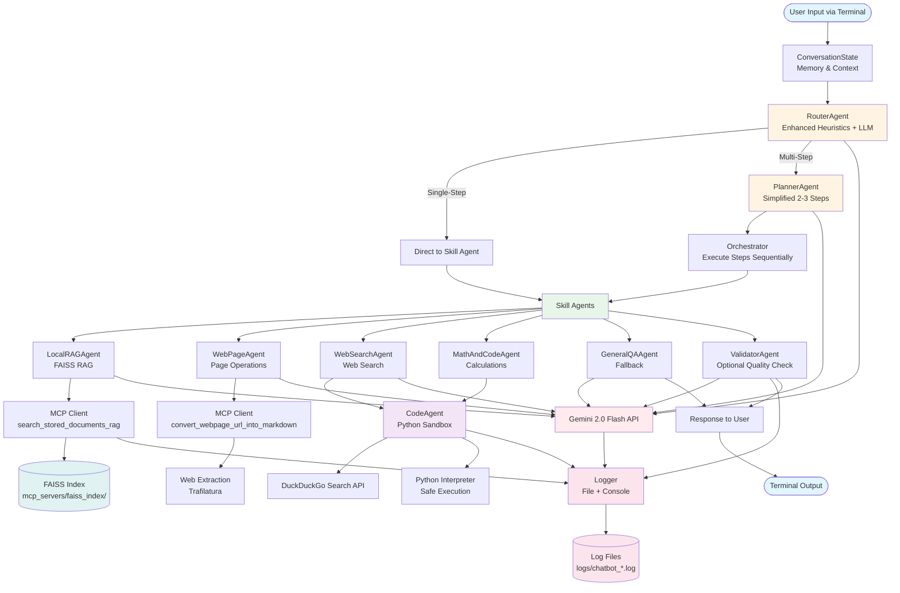

# Architecture Diagrams

This file contains visual representations of the chatbot architecture.

---

## Mermaid Diagram



---

## ASCII Architecture Diagram

```
┌─────────────────────────────────────────────────────────────────────────┐
│                         TERMINAL CHAT INTERFACE                          │
│                         (TerminalChatLoop)                               │
└──────────────────────────────┬──────────────────────────────────────────┘
                               │
                               ▼
┌─────────────────────────────────────────────────────────────────────────┐
│                      CONVERSATION STATE (Memory)                         │
│  • Message History (last 10-20 messages)                                │
│  • Session Context (last_url, last_folder, last_task_type)             │
└──────────────────────────────┬──────────────────────────────────────────┘
                               │
                               ▼
┌─────────────────────────────────────────────────────────────────────────┐
│                         ROUTER AGENT                                     │
│  ┌─────────────────────────────────────────────────────────────────┐   │
│  │ Rule-Based Heuristics (Fast Path)                               │   │
│  │  • web_page_ops: "this page", "summarize", URL patterns        │   │
│  │  • web_search: "search the web", "google", "find"              │   │
│  │  • local_rag: "in my notes", "in documents", "in files"        │   │
│  │  • math: operators, "calculate", "compute", "solve"            │   │
│  │  • general: fallback for explanations                           │   │
│  └─────────────────────────────────────────────────────────────────┘   │
│  ┌─────────────────────────────────────────────────────────────────┐   │
│  │ LLM Classification (When Uncertain)                            │   │
│  │  → Gemini 2.0 Flash API                                        │   │
│  └─────────────────────────────────────────────────────────────────┘   │
└───────────────┬─────────────────────────────────────────────────────────┘
                │
        ┌───────┴────────┐
        │                │
        ▼                ▼
   Single-Step      Multi-Step
        │                │
        │                ▼
        │        ┌──────────────────┐
        │        │ PLANNER AGENT    │
        │        │ (Simplified)     │
        │        │ Max 2-3 steps    │
        │        └────────┬─────────┘
        │                 │
        │                 ▼
        │        ┌──────────────────┐
        │        │  ORCHESTRATOR   │
        │        │ Execute Steps   │
        │        └────────┬─────────┘
        │                 │
        └─────────────────┘
                 │
                 ▼
┌─────────────────────────────────────────────────────────────────────────┐
│                          SKILL AGENTS                                   │
├─────────────────────────────────────────────────────────────────────────┤
│                                                                         │
│  ┌──────────────────┐  ┌──────────────────┐  ┌──────────────────┐      │
│  │ LOCAL RAG AGENT │  │  WEB PAGE AGENT │  │ WEB SEARCH AGENT │      │
│  │                 │  │                 │  │                  │      │
│  │ • Query FAISS   │  │ • Summarize     │  │ • Search Web     │      │
│  │ • Get chunks    │  │ • Count words   │  │ • Process results│      │
│  │ • Build RAG     │  │ • Extract URLs  │  │ • Use CodeAgent  │      │
│  │   prompt        │  │                 │  │                  │      │
│  │                 │  │                 │  │                  │      │
│  │ → MCP:         │  │ → MCP:          │  │ → CodeAgent:    │      │
│  │   search_      │  │   convert_      │  │   DuckDuckGo    │      │
│  │   stored_      │  │   webpage_      │  │   API calls     │      │
│  │   documents_   │  │   url_into_     │  │                 │      │
│  │   rag          │  │   markdown      │  │                 │      │
│  └────────┬───────┘  └────────┬────────┘  └────────┬─────────┘      │
│           │                   │                    │                 │
│  ┌────────┴───────┐  ┌────────┴────────┐  ┌────────┴─────────┐      │
│  │ MATH/CODE AGENT│  │ GENERAL QA     │  │                  │      │
│  │                │  │ AGENT          │  │                  │      │
│  │ • Calculations │  │ • Fallback     │  │                  │      │
│  │ • Code exec    │  │ • Explanations │  │                  │      │
│  │                │  │                │  │                  │      │
│  │ → CodeAgent:   │  │ → Gemini 2.0   │  │                  │      │
│  │   Python       │  │   Direct       │  │                  │      │
│  │   sandbox      │  │                │  │                  │      │
│  └────────┬───────┘  └────────┬───────┘  └──────────────────┘      │
│           │                    │                                      │
└───────────┼────────────────────┼──────────────────────────────────────┘
            │                    │
            ▼                    ▼
┌─────────────────────────────────────────────────────────────────────────┐
│                         CODE AGENT                                      │
│  • Python Code Execution (Sandboxed)                                    │
│  • Allowed: math, numpy, scipy, requests, duckduckgo_search            │
│  • Blocked: file writes, system commands, dangerous imports           │
│  • AST Validation + Restricted Namespace                               │
└───────────────┬─────────────────────────────────────────────────────────┘
                │
                ▼
┌─────────────────────────────────────────────────────────────────────────┐
│                         MCP CLIENT                                      │
│  • MultiMCP Wrapper                                                    │
│  • Server: mcp_servers/mcp_server_2.py                                 │
│  • Tools: search_stored_documents_rag, convert_webpage_url_into_...    │
└───────────────┬─────────────────────────────────────────────────────────┘
                │
                ▼
┌─────────────────────────────────────────────────────────────────────────┐
│                    FAISS VECTOR STORE                                   │
│  • Location: mcp_servers/faiss_index/                                   │
│  • Index: index.bin                                                    │
│  • Metadata: metadata.json                                             │
│  • Documents: mcp_servers/documents/                                   │
└─────────────────────────────────────────────────────────────────────────┘

┌─────────────────────────────────────────────────────────────────────────┐
│                      GEMINI 2.0 FLASH API                              │
│  • Model: gemini-2.0-flash-exp                                         │
│  • Used by: Router, Planner, Skill Agents, Validator                  │
│  • API Key: GOOGLE_API_KEY (.env)                                      │
│  • Retry Logic: 3 attempts with exponential backoff                    │
└─────────────────────────────────────────────────────────────────────────┘

┌─────────────────────────────────────────────────────────────────────────┐
│                    VALIDATOR AGENT (Optional)                           │
│  • Quality Check for RAG/Web answers                                    │
│  • Confidence scoring                                                  │
│  • Improvement suggestions                                              │
└───────────────┬─────────────────────────────────────────────────────────┘
                │
                ▼
┌─────────────────────────────────────────────────────────────────────────┐
│                         LOGGER                                          │
│  • Levels: DEBUG, INFO, WARNING, ERROR, CRITICAL                       │
│  • File: logs/chatbot_YYYY-MM-DD.log (daily rotation)                 │
│  • Format: JSON (structured)                                          │
│  • Console: User-friendly messages                                     │
│  • Components: All agents, CodeAgent, MCP, Gemini API                  │
└───────────────┬─────────────────────────────────────────────────────────┘
                │
                ▼
┌─────────────────────────────────────────────────────────────────────────┐
│                      LOG FILES                                          │
│  • logs/chatbot_2025-01-15.log                                         │
│  • logs/chatbot_2025-01-16.log                                         │
│  • logs/error_summary.json                                             │
│  • Retention: 30 days, compress after 7 days                           │
└─────────────────────────────────────────────────────────────────────────┘

                               │
                               ▼
┌─────────────────────────────────────────────────────────────────────────┐
│                      RESPONSE TO USER                                   │
│  • Formatted output                                                    │
│  • Source citations (for RAG)                                          │
│  • Error messages (user-friendly)                                       │
└─────────────────────────────────────────────────────────────────────────┘
```

---

## Component Interaction Flow

```
┌─────────────┐
│   USER      │
│  "Search my │
│  notes for  │
│   RAG"      │
└──────┬──────┘
       │
       ▼
┌─────────────────┐     ┌──────────────┐
│ TerminalChatLoop│────▶│ Conversation │
│                 │     │    State     │
└────────┬────────┘     └──────┬───────┘
         │                     │
         └──────────┬──────────┘
                    │
                    ▼
         ┌──────────────────┐
         │  RouterAgent     │
         │  (Heuristics)    │
         │  → local_rag     │
         └────────┬─────────┘
                  │
                  ▼
         ┌──────────────────┐
         │ LocalRAGAgent   │
         └────────┬─────────┘
                  │
         ┌────────┴────────┐
         │                 │
         ▼                 ▼
    ┌────────┐      ┌─────────────┐
    │  MCP   │      │   Gemini    │
    │ Client │      │  2.0 Flash  │
    └───┬────┘      └──────┬──────┘
        │                  │
        ▼                  │
  ┌──────────┐             │
  │  FAISS   │             │
  │  Index   │             │
  └────┬─────┘             │
       │                   │
       └──────────┬─────────┘
                  │
                  ▼
         ┌──────────────────┐
         │  ValidatorAgent  │
         │  (Optional)      │
         └────────┬─────────┘
                  │
                  ▼
         ┌──────────────────┐
         │     Logger       │
         │  (File + Console)│
         └────────┬─────────┘
                  │
                  ▼
         ┌──────────────────┐
         │  User Response   │
         │  "Based on your │
         │  documents..."   │
         └──────────────────┘
```

---

## Data Flow Example: Multi-Step Query

```
User: "Search the web for semaris create, then get the URL where official docs are, then summarise that page"

1. RouterAgent
   ├─→ Detects: multi-step task
   └─→ Calls PlannerAgent

2. PlannerAgent
   ├─→ Step 1: WebSearchAgent("semaris create official docs")
   ├─→ Step 2: Extract URL from search results
   └─→ Step 3: WebPageAgent(summarize URL)

3. Orchestrator executes:
   ├─→ WebSearchAgent
   │   ├─→ CodeAgent generates: duckduckgo_search code
   │   ├─→ Execute code → Get search results
   │   └─→ Return: [{"title": "...", "url": "https://..."}]
   │
   ├─→ Extract URL (from results)
   │   └─→ URL: "https://semaris.create/docs"
   │
   └─→ WebPageAgent
       ├─→ MCP: convert_webpage_url_into_markdown("https://...")
       ├─→ Get markdown content
       ├─→ Gemini 2.0: Summarize markdown
       └─→ Return: "The official documentation for semaris create..."

4. ValidatorAgent
   ├─→ Check: Does answer address user query?
   └─→ Return: Validated answer

5. Logger
   ├─→ Log all steps (DEBUG level)
   ├─→ Log tool calls (INFO level)
   └─→ Log any errors (ERROR level)

6. Response to User
   └─→ "Based on the official documentation for semaris create: [summary]"
```

---

## Error Handling Flow

```
┌─────────────────┐
│  Agent/Tool     │
│  Execution      │
└────────┬────────┘
         │
         ▼
    ┌─────────┐
    │ Success?│
    └────┬────┘
         │
    ┌────┴────┐
    │         │
   YES       NO
    │         │
    │         ▼
    │    ┌──────────────┐
    │    │ Error Type?  │
    │    └──────┬───────┘
    │           │
    │    ┌──────┴───────┐
    │    │             │
    │ Transient    Permanent
    │    │             │
    │    │             ▼
    │    │    ┌─────────────────┐
    │    │    │ Log ERROR       │
    │    │    │ Return user-    │
    │    │    │ friendly msg    │
    │    │    └─────────────────┘
    │    │
    │    ▼
    │ ┌─────────────────┐
    │ │ Retry Logic     │
    │ │ (max 3 times)   │
    │ │ Exponential     │
    │ │ backoff         │
    │ └────────┬────────┘
    │          │
    │    ┌─────┴─────┐
    │    │           │
    │ Success    Failure
    │    │           │
    │    │           ▼
    │    │    ┌─────────────────┐
    │    │    │ Log ERROR       │
    │    │    │ Return user-    │
    │    │    │ friendly msg    │
    │    │    └─────────────────┘
    │    │
    └────┴──────────────┘
              │
              ▼
    ┌──────────────────┐
    │ Continue Flow    │
    └──────────────────┘
```

---

## Legend

- **Blue boxes**: User interface / Terminal
- **Yellow boxes**: Decision/Planning agents
- **Green boxes**: Skill agents
- **Purple boxes**: Code execution
- **Red boxes**: LLM API calls
- **Pink boxes**: Logging
- **Teal boxes**: Data storage

